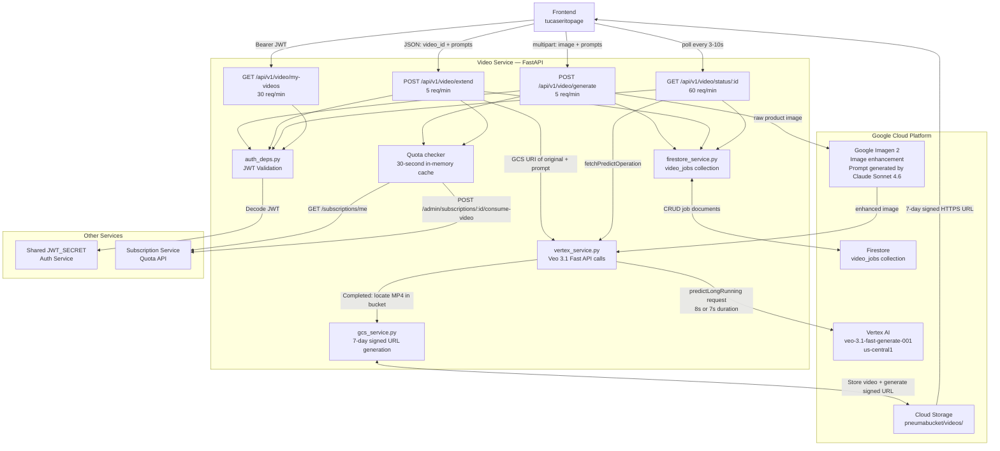

# Tu Caserito — Video Service

## Overview

The Video Service is the production core of the Tu Caserito platform. It accepts a product image and the Veo prompts generated by the Scripts Service, checks the user's quota via the Subscription Service, and orchestrates a two-stage AI pipeline: first, the product image is enhanced via **Google Imagen 2** (using an enhancement prompt generated by **Claude Sonnet 4.6** to improve quality and clarity), then the enhanced image is submitted to **Google Vertex AI Veo 3.1 Fast** (`veo-3.1-fast-generate-001`) to render an 8-second video. Generated videos are automatically stored in **Google Cloud Storage** and delivered to the user via 7-day signed URLs. A separate `extend` endpoint chains a 7-second continuation onto an existing completed video. All jobs are tracked in Firestore — enabling asynchronous polling, auto-recovery of stuck jobs, and full per-user video history.

---

## Architecture



---

## Tech Stack

| Layer | Technology |
|---|---|
| Framework | FastAPI |
| Server | Uvicorn |
| Image Enhancement | Google Imagen 2 via Vertex AI · enhancement prompt generated by Claude Sonnet 4.6 |
| Video Generation | Google Vertex AI — `veo-3.1-fast-generate-001` |
| Object Storage | Google Cloud Storage |
| Database | Google Cloud Firestore |
| HTTP Client | `httpx` (async) |
| Rate Limiting | SlowAPI (per-IP) |
| JWT Validation | `python-jose[cryptography]` |
| GCP Auth | `google-auth` + service account JSON |
| Caching | `cachetools` (in-memory quota cache · 30s TTL) |
| Deployment | Vercel (serverless) |

---

## Environment Variables

| Variable | Required | Description |
|---|---|---|
| `GOOGLE_CREDENTIALS_JSON` | Yes | GCP service account JSON string — needs Vertex AI, Cloud Storage, and Firestore permissions |
| `GCS_BUCKET_NAME` | Yes | Cloud Storage bucket where Veo writes and serves rendered videos |
| `GOOGLE_CLOUD_REGION` | Yes | GCP region for Vertex AI (e.g., `us-central1`) |
| `JWT_SECRET` | Yes | Shared JWT signing secret — must match the Auth Service |
| `SUBSCRIPTION_SERVICE_URL` | Yes | Base URL of the Subscription Service for quota checks and consumption |
| `SUBSCRIPTION_ADMIN_API_KEY` | Yes | Admin key for server-to-server quota consumption calls |
| `ALLOWED_ORIGINS` | Optional | JSON array of allowed CORS origins (default: `["https://www.tucaserito.com"]`) |

> **Security policy:** Never commit `.env` or any secrets to version control. Use `.env.example` as the reference template. `SUBSCRIPTION_ADMIN_API_KEY` is a service-to-service secret and must never be exposed to the browser.

---

## API Endpoints

All endpoints (except `/health`) require `Authorization: Bearer <access_token>`.

---

### `POST /api/v1/video/generate`

Submits an image-to-video job. The uploaded image is first enhanced via Google Imagen 2 before being passed to Veo 3.1. Returns immediately with a `video_id`; the caller must poll `/status/:id` to get the final URL.

**Rate limit:** 5 requests / minute (per IP)

**Request:** `multipart/form-data`

| Field | Type | Description |
|---|---|---|
| `images` | File(s) | 1–3 product images · JPEG, PNG, or WebP · max 5 MB each |
| `prompt_veo_visual` | string | Visual/camera direction for Veo (English) |
| `prompt_veo_audio` | string | Audio and music direction — setting this enables `generateAudio: true` (optional) |
| `aspect_ratio` | string | `"16:9"` or `"9:16"` (default: `"16:9"`) — must match the physical image dimensions |
| `script_text` | string | Narration text stored in Firestore metadata (optional) |

**Response `202 Accepted`:**
```json
{
  "video_id": "c3fc1849-6a58-407b-bc54-a1dc407a34f7",
  "status": "PROCESSING"
}
```

**Error responses:** `400` (invalid image, aspect ratio mismatch), `401` (invalid JWT), `402` (quota exhausted), `429` (rate limit exceeded)

---

### `POST /api/v1/video/extend`

Generates a 7-second continuation of an existing completed video. Uses the original video's GCS URI as the seed for Veo's video-to-video generation. Always inherits the `aspect_ratio` of the original.

**Rate limit:** 5 requests / minute (per IP)

**Request:** `application/json`

```json
{
  "video_id": "uuid of the original completed video",
  "prompt_veo_visual": "Camera follows the character into the sunset...",
  "prompt_veo_audio": "Epic rock music finale.",
  "script_text": "Optional closing narration text"
}
```

**Response `202 Accepted`:** A new `video_id` is returned. The original video is preserved unchanged.

```json
{
  "video_id": "f1ffafbb-3cf3-4064-9955-2582d71e6001",
  "status": "PROCESSING"
}
```

---

### `GET /api/v1/video/status/{video_id}`

Polls the status of a video generation job. When the Vertex AI Long-Running Operation completes, this endpoint downloads the MP4, generates a signed URL, and updates Firestore.

**Rate limit:** 60 requests / minute (per IP)

**Response `200 OK`:**

**While generating:**
```json
{
  "video_id": "c3fc1849-...",
  "status": "PROCESSING",
  "progress": { "predictLongRunningMetadata": {} }
}
```

**On success:**
```json
{
  "video_id": "c3fc1849-...",
  "status": "COMPLETED",
  "video_url": "https://storage.googleapis.com/pneumabucket/videos/...?X-Goog-Signature=..."
}
```

**On failure (AI safety filter, quota, or aspect ratio mismatch):**
```json
{
  "video_id": "c3fc1849-...",
  "status": "FAILED",
  "error": "The request aspect ratio ASPECT_RATIO_16_9 doesn't match the width 1080 and height 1920."
}
```

> Signed URLs are valid for **7 days**. After expiry, call `my-videos` to refresh them.

---

### `GET /api/v1/video/my-videos`

Lists all videos generated by the authenticated user. Auto-heals stuck `PROCESSING` jobs by polling Vertex AI for their final state.

**Rate limit:** 30 requests / minute (per IP)

**Response `200 OK`:**
```json
{
  "videos": [
    {
      "video_id": "string",
      "status": "COMPLETED",
      "created_at": "ISO 8601",
      "updated_at": "ISO 8601",
      "metadata": {
        "prompt_visual": "...",
        "prompt_audio": "...",
        "duration": 8,
        "aspect_ratio": "16:9",
        "script_text": "..."
      },
      "final_url": "https://storage.googleapis.com/..."
    }
  ]
}
```

---

### `GET /api/v1/video/list` _(Admin)_

Lists videos for all users. Requires an admin key header instead of a user JWT.

**Headers:** `X-Admin-Key: <SUBSCRIPTION_ADMIN_API_KEY>`

**Response:** Same structure as `my-videos`.

---

### `GET /health`

Liveness probe.

**Response `200 OK`:** `{ "status": "ok" }`

---

## How to Run Locally

### Prerequisites
- Python 3.11+
- A GCP project with Vertex AI API, Cloud Storage, and Firestore enabled
- A running instance of the Subscription Service (or a local stub)
- JWT secret matching the Auth Service

### Steps

```bash
# 1. Navigate to the service directory
cd tucaserito_video_service

# 2. Create and activate a virtual environment
python -m venv venv
source venv/bin/activate     # macOS / Linux
venv\Scripts\activate        # Windows

# 3. Install dependencies
pip install -r requirements.txt

# 4. Configure environment variables
cp .env.example .env
# Edit .env and fill in:
#   GOOGLE_CREDENTIALS_JSON=<service-account-json-as-single-line-string>
#   GCS_BUCKET_NAME=<your-gcs-bucket-name>
#   GOOGLE_CLOUD_REGION=us-central1
#   JWT_SECRET=<same-secret-as-auth-service>
#   SUBSCRIPTION_SERVICE_URL=http://localhost:8004
#   SUBSCRIPTION_ADMIN_API_KEY=<admin-key>
#   ALLOWED_ORIGINS=["http://localhost:3000"]

# 5. Start the development server
uvicorn app.main:app --reload --port 8003
```

The service will be available at `http://localhost:8003`.  
Interactive API docs: `http://localhost:8003/docs`

> **Note on video generation time:** Veo 3.1 typically takes **1–3 minutes** to render an 8-second video. After receiving a `202 PROCESSING` response, poll `GET /api/v1/video/status/{video_id}` every 5–10 seconds until `status` is `COMPLETED` or `FAILED`.
